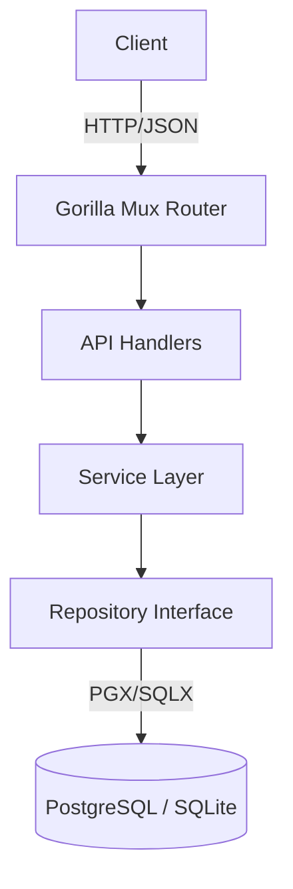

# Architecture & Internals

This document describes the high-level architecture of GeoCity. 
Read it if you want to understand the internal workings of the system.

## High-Level Overview

GeoCity is a standard 3-layer Go microservice:

## Layers

### 1. Transport Layer (`internal/api`)
- **Responsibility**: Decoding HTTP requests, validating inputs, encoding JSON responses.
- **Key Components**: `Handler`, `Router`.
- **Dependency**: Depends only on the `Service` interface.

### 2. Service Layer (`internal/service`)
- **Responsibility**: Business logic, default value handling (e.g., default language `en`), orchestration.
- **Example**: `SuggestCities` logic checks input length before calling the repo.
- **Dependency**: Depends on `Repository` interfaces.

### 3. Data Layer (`internal/repository`)
- **Responsibility**: Constructing SQL queries, mapping rows to structs.
- **Pattern**: Repository Pattern with strategy implementation for different DB drivers.
- **Files**:
    - `repository.go`: Interfaces definition.
    - `pg_impl.go`: PostgreSQL specific optimizations (`unaccent`, `ILIKE`).
    - `sqlite_impl.go`: SQLite specific logic (math functions for Haversine).

## Data Seeding Strategy (`internal/seeder`)

The GeoCity seeder is designed to handle large datasets (GeoNames `cities1000.txt` and `alternateNames.txt` are hundreds of MBs) without exhausting memory.

### Streaming Parse
Instead of loading the entire file into memory, we use `bufio.Scanner` to stream the files line-by-line.

### Batch Insertion
To improve write performance:
1. Records are accumulated in a slice buffer.
2. When the buffer hits `SEEDER_BATCH_SIZE` (default 10k), a `bulk insert` query is executed.
3. SQLite parameters are chunked smaller (approx 900 params) due to SQLite limits.

## Database Design

### Schema
- **Countries**: Normalized table.
- **Cities**: Contains lat/lon, population, timezone.
- **Translations**: Separate tables `city_translations` and `country_translations` linked by FK.

### Indexes
Performance relies heavily on indexes:
- `idx_cities_population`: Ensures popular cities appear first.
- `trgm` / `pattern` indexes: Used in Postgres for fast fuzzy text searching.

### Geo-Spatial Math

#### Distance Calculation
- **Postgres**: Uses PostGIS (if available) or standard Earth distance formulas.
- **SQLite**: Implements the **Haversine formula** purely in Go/SQL math functions because SQLite lacks native geo-functions by default.